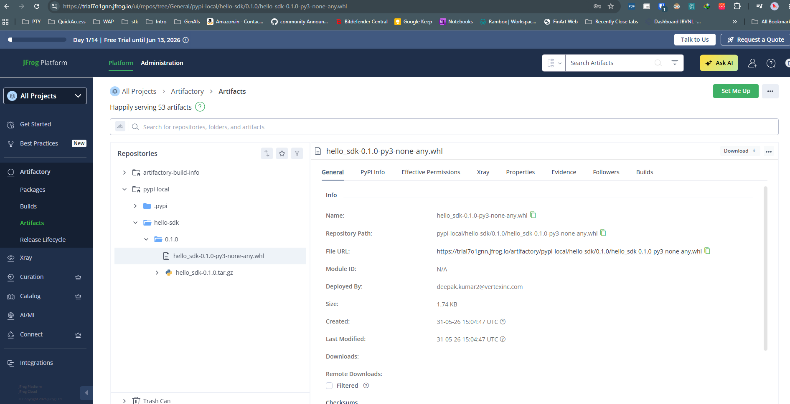
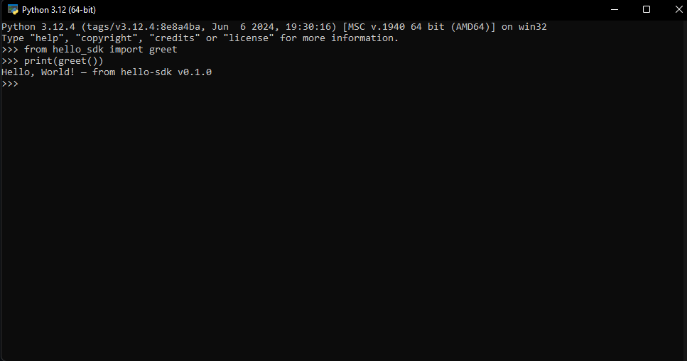

# PythonSdkToJFrogToPipUv

POC: build a Python package (`hello-sdk`), publish it to **JFrog Artifactory Cloud (PyPI local repo)** via GitHub Actions, and install it with `pip` or `uv`.

---

## Project structure

```
PythonSdkToJFrogToPipUv/
├── hello_sdk/                   the Python package
│   ├── __init__.py
│   └── hello.py                 greet() + main()
├── pyproject.toml               modern build config (setuptools + wheel)
├── docker-compose.yml           JFrog Artifactory OSS for local dev/testing
├── scripts/
│   └── setup_jfrog_local.py    auto-creates the PyPI repo on local Docker instance
├── .github/workflows/
│   └── publish.yml              GitHub Actions: build → publish to JFrog Cloud
├── .env.example                 secrets template
└── .gitignore
```

---

## Part 1 — One-time JFrog Cloud setup

> Instance used in this POC: `https://trial7o1gnn.jfrog.io`
> Replace with your own instance URL if different.

### Step 1 — Create the local PyPI repository

1. Log in to JFrog Cloud → click **Administration** (top nav)
2. Left sidebar → **Repositories**
3. Click **"Create a Repository"** (top right) → a panel slides in on the right
4. Choose **Local** ("Upload and resolve your own packages")
5. Package type picker appears → select **PyPI**
6. Set **Repository Key** = `pypi-local`
7. Leave all other fields as default
8. Click **"Create Local Repository"**

You now have two URLs for this repo:

| Purpose | URL |
|---|---|
| Upload (twine / CI) | `https://trial7o1gnn.jfrog.io/artifactory/api/pypi/pypi-local/` |
| Install index (pip / uv) | `https://trial7o1gnn.jfrog.io/artifactory/api/pypi/pypi-local/simple/` |

### Step 2 — Generate an API token

1. Click the **user icon** (top-right corner)
2. Click **"Edit Profile"**
3. Scroll down to **"Identity Tokens"**
4. Click **"Generate Token"**
5. Copy the token immediately — it will not be shown again

### Step 3 — Set GitHub repository secrets

Go to your GitHub repo → **Settings** → **Secrets and variables** → **Actions** → **New repository secret**

Add these three secrets:

| Secret name | Value |
|---|---|
| `JFROG_PYPI_URL` | `https://trial7o1gnn.jfrog.io/artifactory/api/pypi/pypi-local/` |
| `JFROG_USERNAME` | your JFrog Cloud login email |
| `JFROG_PASSWORD` | the identity token from Step 2 |

---

## Part 2 — How the GitHub Actions workflow works

File: `.github/workflows/publish.yml`

**Triggers:**
- Pushing a version tag matching `v*.*.*`
- Manual run from the Actions tab (`workflow_dispatch`)

**Jobs:**

```
build  →  installs build tools
       →  runs: python -m build
       →  produces: dist/hello_sdk-x.y.z-py3-none-any.whl
                    dist/hello_sdk-x.y.z.tar.gz
       →  uploads both as GitHub artifacts

publish →  downloads the artifacts
        →  runs: twine upload --repository-url $JFROG_PYPI_URL dist/*
        →  package is now live in pypi-local on JFrog Cloud
```

---

## Part 3 — Testing end to end via a version tag

This is the full test sequence from a clean state.

### 3a. Make sure GitHub secrets are set (Part 1 Step 3 above)

### 3b. Commit and push any pending changes

```powershell
git add .
git commit -m "your message"
git push origin main
```

### 3c. Create and push a version tag

```powershell
# Create an annotated tag
git tag -a v0.1.0 -m "release v0.1.0"

# Push the tag — this triggers the GitHub Actions workflow
git push origin v0.1.0
```

### 3d. Watch the workflow run

1. Go to your GitHub repo → **Actions** tab
2. You will see **"Build and Publish to JFrog PyPI"** running
3. Two jobs appear: `build` then `publish`
4. Both should show a green checkmark when done (~1-2 minutes)

If `publish` fails, click the job → expand the **"Publish to JFrog"** step to read the twine error output.

### 3e. Verify the artifact and install

See **Part 4** below for the full verification checklist — UI check, browser ping, pip/uv install, and CLI run.

---

## Part 4 — Verify the artifact after GitHub Actions succeeds

Once the **"Build and Publish to JFrog PyPI"** workflow shows a green checkmark, confirm the package actually landed.

### 4a. Check in JFrog Cloud UI

1. Go to `https://trial7o1gnn.jfrog.io`
2. Left sidebar → **Artifactory** → **Artifacts**
3. In the repository tree, expand **`pypi-local`**
4. You should see:
   ```
   pypi-local/
   └── hello-sdk/
       └── 0.1.0/
           ├── hello_sdk-0.1.0-py3-none-any.whl
           └── hello_sdk-0.1.0.tar.gz
   ```
5. Click any file to inspect its metadata — name, repository path, file URL, deployed by, size, created timestamp



### 4b. Quick browser check (no UI login needed)

Hit the simple index URL directly:

```
https://trial7o1gnn.jfrog.io/artifactory/api/pypi/pypi-local/simple/hello-sdk/
```

If the package is there it returns an HTML page listing the downloadable files.
A 404 or empty page means the upload did not complete.

### 4c. Verify it is installable

```powershell
pip install hello-sdk `
  --index-url https://trial7o1gnn.jfrog.io/artifactory/api/pypi/pypi-local/simple/ `
  --extra-index-url https://pypi.org/simple/
```

```powershell
# via uv
uv add hello-sdk --index-url https://trial7o1gnn.jfrog.io/artifactory/api/pypi/pypi-local/simple/
```

### 4d. Run the package

```python
>>> from hello_sdk import greet
>>> print(greet())
Hello, World! — from hello-sdk v0.1.0
>>> print(greet("JFrog"))
Hello, JFrog! — from hello-sdk v0.1.0
```



Or via the CLI entry point installed by the wheel:

```powershell
hello-sdk
# Hello, World! — from hello-sdk v0.1.0
```

---

## Part 5 — Local workflow (Docker Desktop)

For local development and testing without GitHub Actions, use the bundled Docker Compose setup.

```powershell
# 1. Start Artifactory OSS locally (first boot takes ~90s)
docker compose up -d

# 2. Auto-configure — waits for readiness, creates 'pypi-local' repo
pip install requests
python scripts/setup_jfrog_local.py

# 3. Build
pip install build twine
python -m build

# 4. Publish to local instance
twine upload `
  --repository-url http://localhost:8082/artifactory/api/pypi/pypi-local/ `
  -u admin -p password `
  dist/*

# 5. Install from local instance
pip install hello-sdk `
  --index-url http://localhost:8082/artifactory/api/pypi/pypi-local/simple/ `
  --trusted-host localhost
```

Artifactory UI (local): **http://localhost:8082/ui** — admin / password

---

## About the JFrog repo type

There are three repository types in Artifactory:

| Type | Purpose |
|---|---|
| **Local** | Store and serve your own packages — this is what we use |
| **Remote** | Proxy and cache packages from public registries (e.g. PyPI.org) |
| **Virtual** | A single URL that aggregates Local + Remote repos together |

`twine upload` points at the **Local** repo's base URL.
`pip install --index-url` points at the same repo's `/simple/` endpoint.
